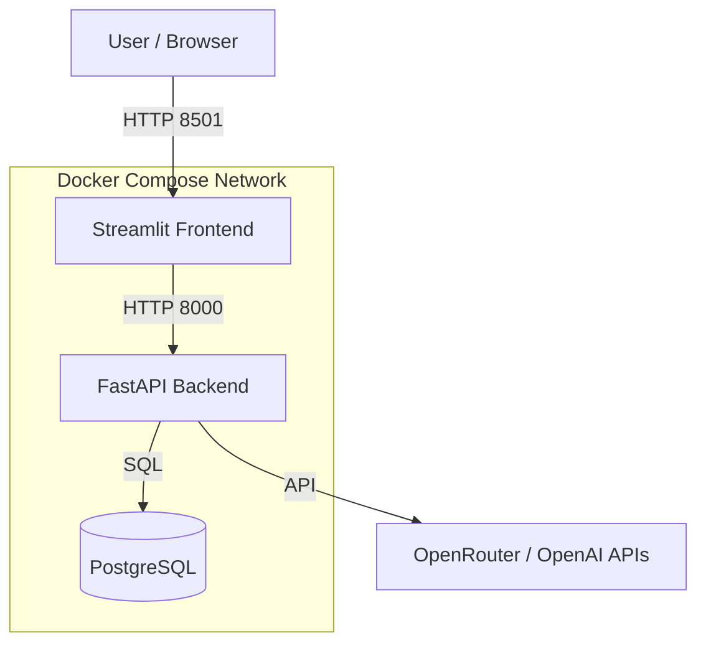

# Enterprise Document Intelligence Platform (RAG System)

A Dockerized, AI-powered document management and question-answering system. It utilizes **RAG (Retrieval-Augmented Generation)** to allow users to upload PDF/DOCX/TXT files and query them using natural language.

---

## 🌟 Features

- **📄 Smart Document Processing**: Automatically parses and chunks PDFs, Word docs, and Text files.
- **🔍 Semantic Search (RAG)**: detailed answers based *only* on your uploaded documents.
- **🌐 Dockerized**: Full stack (Frontend, Backend, Database) deployment with one command.
- **🤖 Multi-LLM Support**: Configured for **OpenRouter** (access to Gemini, GPT-4, Claude, etc.).
- **🇹🇼 Localized**: Full Traditional Chinese interface and AI responses.
- **⚙️ Admin Dashboard**: 
    - Token usage monitoring and limits.
    - System configuration.
    - Document management (List/Delete).
- **🔗 Source Transparency**: Answers cite specific source documents with download links.

---

## 🏗️ System Architecture



- **Frontend**: Streamlit (Python). Simple, interactive UI for file upload and chat.
- **Backend**: FastAPI (Python). Handles parsing, vector embedding, and RAG logic.
- **Database**: PostgreSQL (pgvector compatible) for storing metadata, raw text, and configuration.
- **AI Engine**: Connects to OpenRouter for Embeddings and Chat Completion.

---

## 🚀 Quick Start (Docker)

### Prerequisites
- Docker & Docker Compose installed.
- An API Key (e.g., OpenRouter, OpenAI, or Google Gemini).

### Steps

1. **Clone the repository**
   ```bash
   git clone https://github.com/benchen1981/AIIS-Homework5-Q2RAG.git
   cd AIIS-Homework5-Q2RAG
   ```

2. **Configure Environment**
   Create a `.env` file in the root directory:
   ```bash
   # LLM Configuration
   LLM_PROVIDER=openrouter
   OPENROUTER_API_KEY=sk-or-your-api-key-here
   OPENROUTER_MODEL=google/gemini-2.0-flash-exp:free # or any other model
   
   # Database (Default)
   POSTGRES_USER=user
   POSTGRES_PASSWORD=password
   POSTGRES_DB=docdb
   ```

3. **Start the Application**
   ```bash
   docker compose up --build -d
   ```

4. **Access the App**
   - **Frontend UI**: [http://localhost:8501](http://localhost:8501)
   - **Backend API Docs**: [http://localhost:8000/docs](http://localhost:8000/docs)

---

## 📂 Project Structure

Please refer to [`prompt.md`](./prompt.md) for the detailed file tree and development log.

- `backend/`: Core application logic (FastAPI).
- `frontend/`: User interface (Streamlit).
- `data/`: Database persistence folder.
- `docker-compose.yml`: Service definition.

---

## 🛠️ Development Process

This project was developed through an iterative process involving an AI Assistant (Antigravity). The full conversation log and prompts can be found in:

- **[`prompt.md`](./prompt.md)**: Detailed record of user requests and implementation steps.
- **[`debug.md`](./debug.md)**: Comprehensive log of errors encountered (Network, API, Logic) and their solutions.

### Key Milestones
1. **Initialization**: Setup Python environment and basic RAG pipeline.
2. **Containerization**: Wrote Dockerfiles and Compose for microservices architecture.
3. **Connectivity Fix**: Resolved Docker internal networking issues.
4. **Localization**: Enfored Traditional Chinese across UI and AI output.
5. **Optimization**: Added Admin features, Token limits, and duplicate file protection.

---

## 🔗 References
- **Streamlit**: [docs.streamlit.io](https://docs.streamlit.io/)
- **FastAPI**: [fastapi.tiangolo.com](https://fastapi.tiangolo.com/)
- **OpenRouter**: [openrouter.ai](https://openrouter.ai/)
